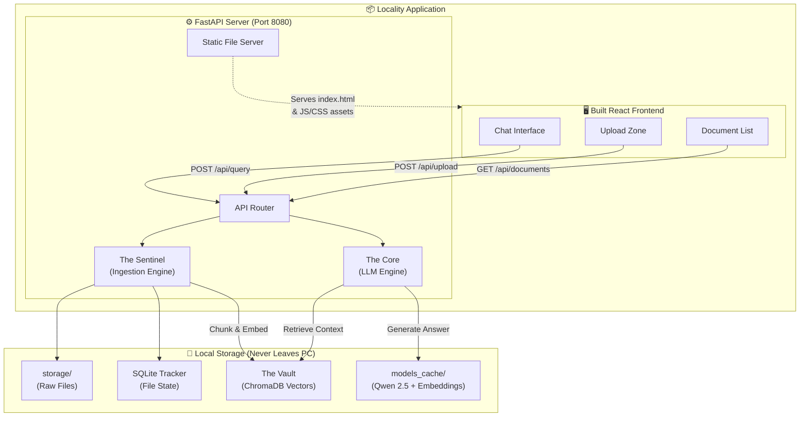
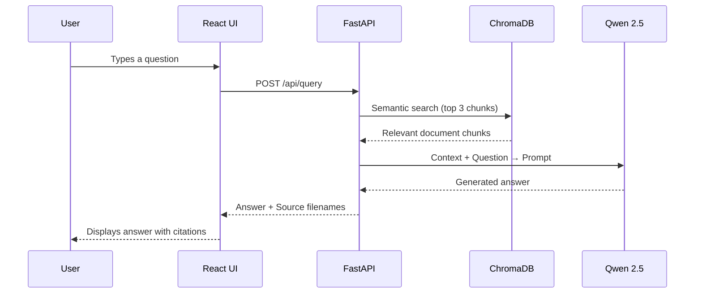
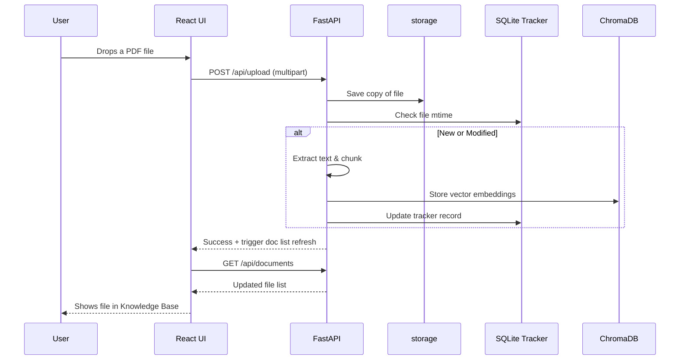
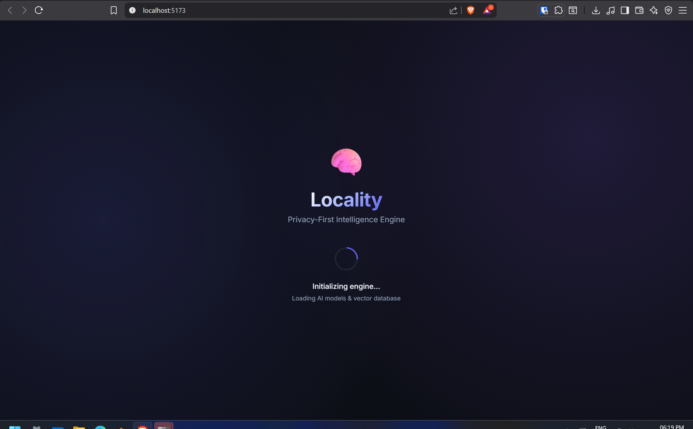
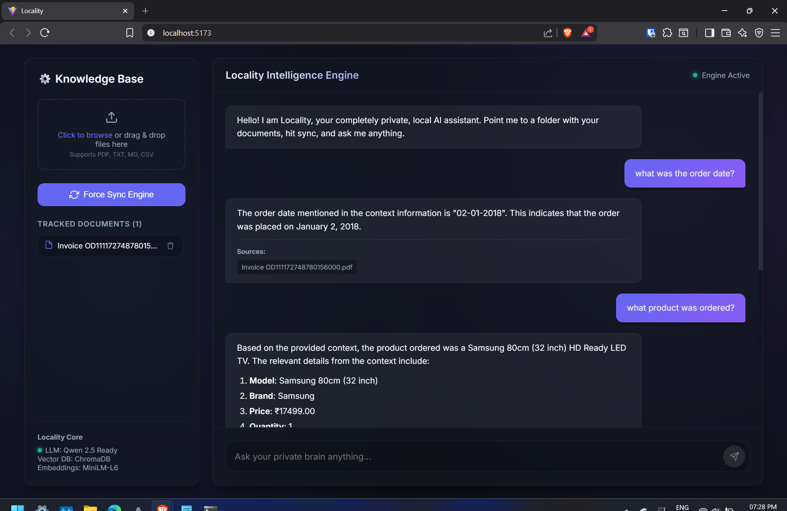

# Locality 🧠
### Privacy-First Local RAG Intelligence Engine

Locality is a high-performance desktop application that transforms a collection of documents into a searchable, interactive private brain. Unlike traditional AI tools, Locality sits directly on your hardware. It processes, indexes, and reasons through text without a single byte of sensitive information ever leaving your machine.

---

## 🏗️ Architecture

The system is built on Three Core Pillars:

### 1. The Sentinel (Data Ingestion)
Handles PDF, Markdown, CSV, and TXT parsing efficiently, breaking them down into clean semantic chunks.
It uses a highly robust local SQLite database combined with the native file `mtime` to detect instantly if a file was added, changed, or deleted, avoiding redundant processing.

### 2. The Vault (Local Vector Database)
A high-speed mathematical index stored on your disk using **ChromaDB**. Every sentence from your files is converted into a vector, allowing the system to find relevant information in milliseconds based on intent rather than just keywords.

### 3. The Core (LLM Engine)
Uses the incredibly fast **Qwen 2.5 0.5B Instruct** model natively in Python via Hugging Face `transformers` on the CPU, making it universally compatible across different devices.

### System Architecture



### Query Flow



### Upload & Sync Flow



---

## ✨ Features
- **UI**: React + Vite frontend.
- **Dynamic File Management**: Sleek drag-and-drop upload zone that automatically copies your documents to an internal `storage` directory and syncs them instantly.
- **Fast Offline AI**: Pre-downloads the LLM and Embedding models completely so that subsequent usages require absolutely **zero internet access**.
- **Real-Time Source Citation:** The AI tells you exactly which document it used to generate the answer.

---

## GUI





---

## 🚀 How to Run (For End Users)

If you downloaded the `Locality_App.zip` release:

1. **Extract the App**: Unzip `Locality_App.zip` to a folder on your computer.
2. **Launch**: Double-click the `start.bat` file.
   - The script will automatically check for Python, set up a secure virtual environment, install all required dependencies, launch the server, and open your web browser to `http://localhost:8080`.
3. **First-Run Note**: 
   The *very first time* you start the system, it will securely download the Qwen 2.5 and ONNX Embedding models to the local `models_cache` folder. **It saves these locally permanently.** You will *never* have to redownload them again. The app works entirely offline after the initial pull.
4. **Knowledge Base Upload**:
   - In the left panel of the UI, click the **Upload Zone** or drag & drop a PDF, Markdown, CSV, or Text file into the box.
5. The app will automatically save a local copy to `storage` and trigger the sync engine to process the knowledge.
6. You'll see your tracked documents appear in the **Knowledge Base** list instantly.
7. Start chatting with your private data!

---

## 💻 How to Run (Development Mode)

If you are a developer cloning the source code:

### 1. Backend Setup
```bash
# Create and activate virtual environment
python -m venv backend_venv
backend_venv\Scripts\activate

# Install dependencies
pip install -r requirements.txt

# Start the FastAPI server (Port 8080)
uvicorn main:app --reload --port 8080
```

### 2. Frontend Setup
Open a **new separate terminal block**:
```bash
cd frontend

# Install Node dependencies
npm install

# Start the Vite development server (Port 5173)
npm run dev
```

### 3. Creating a Release
To package the application into a new obfuscated `.zip` file for end-users, simply run the included release script from the root directory:
```bash
release.bat
```
This batch script automatically:
1. Builds the React frontend.
2. Encrypts and obfuscates the Python backend using `pyarmor`.
3. Assembles the front/backend alongside the `start.bat` launcher.
4. Compresses everything into a ready-to-distribute `Locality_App.zip`.

---

## 🛠️ Technology Stack
- **Backend:** Python + FastAPI
- **Frontend:** React + Vite (TypeScript, Vanilla CSS)
- **Vector Database:** ChromaDB
- **AI Inference Engine:** Hugging Face `transformers` (PyTorch)
- **Database/Sync State:** SQLite + SQLAlchemy
- **Document Parsing:** PyPDF 
